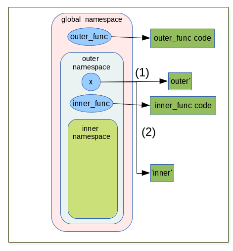

.. _fundamentals:

======================
Fundamentals of python
======================

Variables vs object references
==============================

Value and type
--------------

A **value** is one of the basic things a program works with, like a letter or a number.
The values we have seen so far are ``1``, ``2``, and ``'Hello, World!'``.

These values belong to different **types**: ``2`` is an integer (:ref:`integers`), and ``'Hello, World!'`` is a **string** (:ref:`strings`),
so-called because it contains a "string" of letters. You (and the interpreter) can identify
strings because they are enclosed in quotation marks. We speak speak also of ``data type``.

If you are not sure what type a value has, the interpreter can tell you. ::

   >>> type('Hello, World!')
   <type 'str'>
   >>> type(17)
   <type 'int'>

Not surprisingly, strings belong to the type ``str`` and integers belong to the type ``int``.
Less obviously, numbers with a decimal point belong to a type called ``float``,
because these numbers are represented in a format called ``floating point``. ::

   >>> type(3.2)
   <type 'float'>

What about values like ``'17'`` and ``'3.2'``?
They look like numbers, but they are in quotation marks like strings. ::

   >>> type('17')
   <type 'str'>
   >>> type('3.2')
   <type 'str'>

They're strings.

When you type a large integer, you might be tempted to use commas or space
between groups of three digits, as in ``1,000,000``.
This is not a legal integer in Python, but it is legal: ::

   >>> 1,000,000
   (1, 0, 0)

Well, that's not what we expected at all!  Python interprets ``1,000,000``
as a comma-separated sequence of integers.
This is the first example of a semantic error: the code
runs without producing an error message, but it doesn't do the ``right`` thing.

In Python, both ``str`` and ``int`` are immutable. That is once set their value cannot be changed anymore.
there exist some datatype which are mutable (we will see what this difference implies between this to kind
of datatype in `Mutable objects`_ and `Immutable objects`_)

To convert a data item from one type to another, we can use the syntax *datatype(item)*. For example: ::

   >>> int("45")
   45
   >>> str(45)
   '45'

The ``int`` conversion is tolerant of leading and trailing whitespace. So int(" 45 ") would have worked just as well.
The ``str`` conversion can be applied to almost data item.
If a conversion fails, an exception is raised (we will see fully :ref:`exceptions` later). ::

   >>> int('Hello World!')
   Traceback (most recent call last):
      File "<stdin>", line 1, in <module>
   ValueError: invalid literal for int() with base 10: 'Hello World!'

Variables and Object references
-------------------------------

Once we have data item (or values), the next thing we need is variables in which to store them.
A variable is a name that refers to a value.
One of the most powerful features of a programming language is the ability to manipulate ``variables``.

As I mentioned earlier, in Python everything is an object, even int or string. ::

   >>> isinstance(3, object)
   True
   >>> isinstance('blue', object)
   True

So Python does not have variable as such, but instead has ``object references``. When it comes to immutable objects
like ``str`` or ``int``, there is no discernible difference between variable and an object reference.
As for mutable objects there is a difference, but it rarely maters in practice. So we will use the terms of ``variable``
or ``object reference`` interchangeably.

Let's look at few examples and see what's happen in details: ::

   x = 3
   color = 'green'
   y = color

The syntax is simply ``object reference = value``. There is no need of pre-declaration
and no need to specify the value's type. When Python execute

* the first statement it creates a ``int`` object with the value ``3`` and create the object reference call ``x`` that refer to
  the int object. For all practical purpose we say ``that variable x has been assigned the "3" integer``.
* The second statement is similar.
* The third creates a new object reference y and sets it to refer to the same object
  that the color reference object refers to (in this case the str object containing the value "green").

Let's see what python do behind the scene:

.. figure:: _static/figs/ref_obj.png
   :align: left
   :alt: object references
   :figclass: align-left

| *The circles represents the object references.*
| *The rectangles the objects in memory.*

* The ``=`` operator is not the same as the variable assignment operator in some other languages.
* The ``=`` operator binds an object in memory to an object reference.

    * If the object reference already exists it simply re-bound to refer to the object on the right of = operator;
    * If the reference does not exist, it simply created by the = operator.

.. container:: clearer

    .. image :: _static/figs/spacer.png

Let us continue with the previous example and do some rebinding.

.. image:: _static/figs/rebinding.png
   :width: 250px
   :align: left
   :alt: object references rebinding

\ ::

   >>> print x, color, y  #in python3 syntax or print_function import >>> print(x, color, y)
   3 green green
   >>> x = y
   >>> print x, color, y
   green green green

.. note:: comments begin with a ``#`` and continue until the end of the line

| Now the three objects references are referring to the same string with value "green".
| Since there are no more object references to the int ``3`` Python is free to garbage it.

Python uses *dynamic typing*, which means that an object reference can be rebound to refer
to a different object (which may be a different data type) at any time.

.. container:: clearer

    .. image :: _static/figs/spacer.png

.. _immutable obj:

Immutable objects
=================

As I mentioned in previous paragraph immutable objects are objects that we **cannot** change
the state (the value). We can rebind the reference which was refer to an immutable object
to a **new** object with an other value, but we cannot change the value of the object itself.
We already seen immutable objects, int, str. There is a lot of other data types which are
immutable .

.. _mutable obj:

Mutable objects
===============

.. image:: _static/figs/ref_obj_mutable.png
   :align: left
   :alt: object references of mutable objects

By contrast to the immutable objects, the mutable object are object that we can modify the state (the value).
One example of immutable object is the ``list``.
A list is an object to hold a collection of data items. In the list the items are ordered.
We can easily insert, remove, items whenever we want.

Under the hood, the lists do not store data items at all, but rather object references.
When lists are created and when items are inserted, they take copies of the object references they are given.

.. container:: clearer

    .. image :: _static/figs/spacer.png

| On the figure we see the creation of a list with a reference x on it. This list contains 3 strings 'a', 'b','c'.
| The list does not contains the 3 string objects directly, but the references toward their respective objects.
| We can easily change the state of the list, by rebinding the second element of it to the integer object newly created.
| The string 'b' has no reference any longer that point on it, then Python is free to garbage it.

Functions
=========

Functions are objects
---------------------
Functions are a way to package functionalities. There are 4 kind of functions in Python:

* global functions
* local functions
* lambda functions
* methods

*Global* functions are created with the keyword *def* and take a name and an optional list of parameters.
They are accessible to any code in the same module in which it is created.
They can also be accessible from other modules with a mechanism of import.

*Local* are created as globals functions but defined inside other functions (also called *nested* functions).
These functions are visible only to the function where they are defined.

*Lambda* functions are expressions, so they can be created at their point of use.
however they are much more limited than normal functions.

*Methods* are functions that are bound to a particular data type and can be used only in conjunction with this data type.

global functions, local functions and method are created with the keyword def and return a value.
To return a value we explicitly use the keyword ``return`` if we do not do that ``None`` is return automatically by python.
We can leave a function at any point by using the ``return`` statement (the yield can be used also but will not cover here).
We can call functions by appending parenthesis to the function name. ::

   >>> def global_func():
         return "global_func is a global function"

   >>> print global_func()
      "global_func is a global function"

Nested functions
----------------

It is useful to have helper function inside a function.
To do this we simply define a function inside the definition of an existing function.
Such function are often called *nested* functions or *locals* functions. ::

   def outer():
       x = 1
       def inner():
           return 2
       return x + inner()

   outer()
   3

Function argument vs parameters
-------------------------------

These two terms *parameter* and *argument* are sometimes loosely used interchangeably,
and the context is used to distinguish the meaning.
The term *parameter* (sometimes called *formal parameter*) is often used to refer to the variable as
found in the function definition,
while *argument* (sometimes called *actual parameter*) refers to the actual value passed.
To avoid confusion, it is common to view a parameter as a variable, and an argument as a value.
Python allow us to pass arguments to functions.
The parameter names become local variable of our function [parameters_and_arguments]_.
If there is more parameters than one, they are written as a sequence of comma separated identifiers,
or as sequence of identifier = value pair.
For instance, here is a function that calculates the area of a triangle using Heron's formula: ::

   def heron(a, b, c):
      s = (a + b + c) / 2
      return math.sqrt(s * (s - a) * (s - b) * (s - c))

Inside the function each parameter, *a*, *b*, *c*, is initialized with the corresponding value
that was passed as an argument.
When the function is called, we must supply all arguments, for example, heron(3, 4, 5).
If we give too few or too many arguments, a ``TypeError exception`` will be raised.

When we do a call like this we said to be using a positional arguments,
because each argument passed is set as the value of parameter in the corresponding position.
So in this case, *a* is set to 3, *b* to 4, and *c* to 5, when the function is called.

Some functions have parameters for which there can be sensible default.

.. _arguments_n_parameters:

Argument and Parameter unpacking
--------------------------------
Arguments and Parameters
------------------------

Python has different ways to define function parameters and pass arguments to them. Function parameters can be either

* positional parameters that are mandatory or named,
* keyword parameters that provide a default value.

The parameter syntax does not permit us to follow parameters with default value with parameters that don't have default value.
So def bad(a, b = 1, c) wont work.
We are not force to pass our arguments in the order they appear in the function's definition, instead,
we can use keyword arguments, passing each argument in the form name = value. ::

   def argument(a, b, c = 3, d = 4):
      print '{} {} {} {}'.format(a,b,c,d)

   argument(1,2)
   1 2 3 4

   argument(a = 1, b = 2)
   1 2 3 4

   argument(b = 2, a = 1)
   1 2 3 4

.. warning::

   When default values are given they are created at the time of the *def* statement is executed (i.e. when the function is created),
   **not** when the function is called. For immutable arguments like numbers or strings this doesn't make any difference,
   but for mutable arguments a subtle trap is lurking. ::

      def app(x, lst = []):
          #id print the memory adress of the object
          print( id(lst) )
          lst.append(x)
          return lst

      #the default value of the function app is an empty list
      app.func_defaults
       ([],)

      app(1)
       #the memory adress of lst is 21665048
       21665048
      [1]

      app.func_defaults
      ([1],)
      # now the default value of the app function is list [1]
      # the first call to app have a side effect

      app(2)
       # the memory adress does not change (this is the same object than at the first call
       # the list was created at app function create time.
       21665048
      [1, 2]

      app.func_defaults
      ([1, 2],)

   Here at the list lst was created at function creation time,
   at each call Python reuse the same list to add new element.
   This induce a big and dangerous side effect, and usually it's not the desired behavior.
   Here a new version without side effect: ::

      def app(x, lst = None):
         if lst is None:
           lst = []
         #id print the memory adress of the object
         print( id(lst) )
         lst.append(x)
         return lst

Variable number of parameters
^^^^^^^^^^^^^^^^^^^^^^^^^^^^^

A function can take additional optional arguments by prefixing the last parameter with an \* (asterix). Optional
arguments are then available in the tuple referenced by this parameter.
Optional variables can also by passed as keywords, if the last parameter is preceded by \*\*. In this case, the
optional variables are available within the function as a dictionary.
The operation consisting to get the arguments passed as sequence is call *argument unpacking*.
Let look how it work, especially there are significant differences between python 2 and 3.

Sequence unpacking
^^^^^^^^^^^^^^^^^^

.. list-table:: difference between python 2 and 3 to unpack a sequence
   :header-rows: 1
   :widths: 5 10

   *  - Python2
      - Python3
   *  - The unpacking operator does not exist in Python 2
      - We can unpack any iterables (list, tuples, ...) with the operator \*.
        When used with two or more variables on the left-hand side of an assignment,
        one of which is preceded by \*, items are assigned to the variables,
        with all those left over assigned to the stared variables. ::

         >>> first, *rest = [1,2,3,4]
         >>> first
         1
         >>> rest
         [2, 3, 4]
         >>>
         >>> first, *mid, last = [1,2,3,4]
         >>> first
         1
         >>> mid
         [2, 3]
         >>> last
         4

Argument unpacking
^^^^^^^^^^^^^^^^^^

.. tabularcolumns:: |p{8cm}|p{8cm}|

+----------------------------------------------------------------------------------------------------------------------+--------------------------------------------------------------------+
| Python2                                                                                                              | Python3                                                            |
+======================================================================================================================+====================================================================+
| As the unpacking operator in Python3 we can use                                                                                                                                           |
| the sequence unpacking operator in a function's parameter                                                                                                                                 |
| list (this also works well in python2 or python3).                                                                                                                                        |
| This useful when we want to create functions that can                                                                                                                                     |
| take a variable number of positional arguments. Here a product() function [prog_in_python3]_ .                                                                                            |
|                                                                                                                                                                                           |
| >>> def product(*args):                                                                                                                                                                   |
| ...     result = 1                                                                                                                                                                        |
| ...     for arg in args:                                                                                                                                                                  |
| ...             result *= arg                                                                                                                                                             |
| ...     return result                                                                                                                                                                     |
| ...                                                                                                                                                                                       |
| >>> product(1, 2, 3, 4)                                                                                                                                                                   |
| 24                                                                                                                                                                                        |
| >>>                                                                                                                                                                                       |
| >>> product(2, 3)                                                                                                                                                                         |
| 6                                                                                                                                                                                         |
| >>>                                                                                                                                                                                       |
|                                                                                                                                                                                           |
+----------------------------------------------------------------------------------------------------------------------+--------------------------------------------------------------------+
| We cannot have arguments after unpacking sequence                                                                    | Python3 support keywords arguments following positional arguments, |
|                                                                                                                      | even if it's an unpacking sequence argument.                       |
| >>> def func(*arg, arg2 = None):                                                                                     |                                                                    |
| File "<stdin>", line 1                                                                                               | >>> def func( *arg, arg2 = None):                                  |
| def func(*arg, arg2 = None):                                                                                         | ...     print(arg)                                                 |
|                 ^                                                                                                    | ...     print(arg2)                                                |
| SyntaxError: invalid syntax                                                                                          | ...                                                                |
|                                                                                                                      | >>> func([1,2,3])                                                  |
|                                                                                                                      | ([1, 2, 3],)                                                       |
|                                                                                                                      | None                                                               |
|                                                                                                                      | >>>                                                                |
|                                                                                                                      | >>> func([1,2,3] , arg2='a')                                       |
|                                                                                                                      | ([1, 2, 3],)                                                       |
|                                                                                                                      | a                                                                  |
+----------------------------------------------------------------------------------------------------------------------+--------------------------------------------------------------------+
| Just as we can unpack a sequence to populate a function's positional arguments,                                                                                                           |
| we can unpack a mapping using the mapping unpacking operator ** .                                                                                                                         |
| We can use ** to pass a dictionary to a argument.                                                                                                                                         |
|                                                                                                                                                                                           |
| Here the options dictionary's key-value pairs are unpackecd                                                                                                                               |
| with each key's value being assigned to the parameter whose name is the same as the  key.                                                                                                 |
| If the dictionnary contains a key for wich there is no corresponding parameter,                                                                                                           |
| a TypeError is raised. Any argument for which the dictionary has no corresponding item is set at this default value.                                                                      |
|                                                                                                                                                                                           |
| >>> def func(a = 2, b = 3):                                                                                                                                                               |
| ...     print(a, b)                                                                                                                                                                       |
| ...                                                                                                                                                                                       |
| >>> func(**{'a':4,'b':5})                                                                                                                                                                 |
|                                                                                                                                                                                           |
| >>>                                                                                                                                                                                       |
| >>> func(**{'a':4,'c':5})                                                                                                                                                                 |
| Traceback (most recent call last):                                                                                                                                                        |
| File "<stdin>", line 1, in <module>                                                                                                                                                       |
| TypeError: func() got an unexpected keyword argument 'c'                                                                                                                                  |
| >>>                                                                                                                                                                                       |
| >>> func(**{'a':4})                                                                                                                                                                       |
| >>>                                                                                                                                                                                       |
|                                                                                                                                                                                           |
| We can also use mapping unpacking operator with parameter.                                                                                                                                |
|                                                                                                                                                                                           |
| In this case, the ** operator must be the last argument.                                                                                                                                  |
|                                                                                                                                                                                           |
| >>> def func(a = 2, b = 3,**kwargs):                                                                                                                                                      |
| ...     print a                                                                                                                                                                           |
| ...     print b                                                                                                                                                                           |
| ...     print kwargs                                                                                                                                                                      |
| ...                                                                                                                                                                                       |
| >>> def func(a = 2, b = 3, **kwargs, d = 4):                                                                                                                                              |
| File "<stdin>", line 1                                                                                                                                                                    |
| def func(a = 2, b = 3, **kwargs, d = 4):                                                                                                                                                  |
| ^                                                                                                                                                                                         |
| SyntaxError: invalid syntax                                                                                                                                                               |
| >>>                                                                                                                                                                                       |
| >>> def func(*arg, **kwarg):                                                                                                                                                              |
| ...     print(arg)                                                                                                                                                                        |
| ...     print(kwarg)                                                                                                                                                                      |
| ...                                                                                                                                                                                       |
| >>> func(1, 2, 3)                                                                                                                                                                         |
| arg = (1, 2, 3)                                                                                                                                                                           |
| kwatg = {}                                                                                                                                                                                |
| >>>                                                                                                                                                                                       |
| >>> func([1, 2, 3], a= 'A', b = 'B')                                                                                                                                                      |
| arg = ([1, 2, 3],)                                                                                                                                                                        |
| kwarg = {'a': 'A', 'b': 'B'}                                                                                                                                                              |
| >>>                                                                                                                                                                                       |
| >>> func([1, 2, 3],{'a':'A', 'b':'B'})                                                                                                                                                    |
| arg = ([1, 2, 3], {'a': 'A', 'b': 'B'})                                                                                                                                                   |
| kwarg = {}                                                                                                                                                                                |
| >>> l = [1, 2, 3]                                                                                                                                                                         |
| >>> d = {'a':'A', 'b':'B'}                                                                                                                                                                |
| >>> func(*l, **d)                                                                                                                                                                         |
| arg = (1, 2, 3)                                                                                                                                                                           |
| kwarg = {'a': 'A', 'b': 'B'}                                                                                                                                                              |
+----------------------------------------------------------------------------------------------------------------------+--------------------------------------------------------------------+

Scope of variables
==================

For variables, Python has function scope, module scope, and global scope
(in python the term of namespaces is often used) [Franklin]_ .
Names enter scope at the start of a context (function, module, or globally),
and exit scope when a non-nested function is called or the context ends.
If a name is used prior to variable initialization, this raises a syntax error.

.. _variable_resolution_rules:

Variable resolution rules
-------------------------

Although scopes are determined statically, they are used dynamically.
At any time during execution, there are at least three nested scopes whose namespaces are directly accessible:

#. the innermost scope, which is searched first, contains the local names
#. the scopes of any enclosing functions, which are searched starting with the nearest enclosing scope, contains non-local, but also non-global names
#. the next-to-last scope contains the current module’s global names
#. the outermost scope (searched last) is the namespace containing built-in name

If a variable is simply accessed (not assigned to) in a context,
name resolution follows the LEGB rule (Local, Enclosing, Global, Built-in).
However, if a variable is assigned to, it defaults to creating a local variable,
which is in scope for the entire context. Both these rules can be overridden
with a global or nonlocal (in Python 3) declaration prior to use,
which allows accessing global variables even if there is an intervening nonlocal variable,
and assigning to global or nonlocal variables [scope]_ .

.. container::

   .. image:: _static/figs/namespaces_1.png
      :alt: functions are object
      :align: left
      :height: 200px

   ::

      G = 4
      I = 12
      def func(p):
         I = 5
         res = p + I - G
         return res

.. container::

   We first defined 2 objects references G and I which refer respectively to integers 4 and 12
   then we create a new object reference func which refer to the function code
   (I remember you that in Python everything is an object)

.. container:: clearer

   .. image :: _static/figs/spacer.png

.. container::

   .. image:: _static/figs/namespaces_2.png
      :alt: functions are object
      :align: left
      :height: 400px

   ::

      y = func(3)

.. container::

   #. When we call the function func with argument 3, Python create a namespace local to the function,
       with a first reference object "p" which refer to an integer object with the value 3.
   #. Then the code of the function is executed, a variable "I" is assigned to, so Python creates a new local reference.
   #. I show with small arrows how python resolve the variables to compute the statement
   #. then a reference "res" is created which point to the result of the statement "p + I - G"

.. container:: clearer

   .. image :: _static/figs/spacer.png

.. image:: _static/figs/namespaces_3.png
   :alt: functions are object
   :align: left
   :height: 400px

.. container::

   #. a new reference call "y" to the integer object 4 is created in the global namespace.
   #. the local namespace relative to the function execution is tagged to be removed by the garbage collector.
      As the int object with 4 as value have another reference (y) it will not be destroyed.

.. container:: clearer

   .. image :: _static/figs/spacer.png

We can see this mechanism in action as in Python we can view the content of the local the global namespace
via two built-in functions *locals* and *globals*
The code below is written in Python3.

.. code-block:: python
   :linenos:

      def outer_func():
         x = 'outer'
         print('outer locals = ', locals())
         print(x)

         def inner_func():
            nonlocal x
            print('inner locals = ', locals())
            x = 'inner'
            print('inner locals = ', locals())
            print(x)

         inner_func()
         print('outer locals = ', locals())

      outer_func()

.. container::

   This piece of code illustrate the globals and locals namespaces.
   Although this code is writen in python3 the concepts are the same in python2.
   But the keywords ``nonlocals`` is python3 specific.
   In python2, we can refer to a non local variable, but we cannot assign a new value to a non local variable,
   when we try to assign a new value, a new local object reference is created.

   when we use the ``nonlocals`` keywords the variable find in the outer scope is seen as it belong to the local scope.
   We can manipulate it as a local variable.
   If we reassign a new value to this reference, the outer reference is also modified.

.. container::

   | 3.  outer locals = {'x': 'outer'}
   | 4.  outer
   | 7.  inner locals = {'x': 'outer'}
   | 9.  inner locals = {'x': 'inner'}
   | 10. inner
   | 12. outer locals = {'x': 'inner', 'inner_func': <function outer_func.<locals>.inner_func at 0x7f19d8d965f0>}

.. container:: clearer

   .. image :: _static/figs/spacer.png

.. warning::

    If we consider the code below,
    unlike what we might think in *y = x + 2* *x* is not get from the global scope..

    .. code-block:: python
        :linenos:

        x = 4

        def func(a):
           y = x + 2
           print locals()
           x = y
           return y

        >>> y = func(x)
        Traceback (most recent call last):
          File "<stdin>", line 1, in <module>
          File "<stdin>", line 2, in func
        UnboundLocalError: local variable 'x' referenced before assignment

    As soon as you make an assignment to a variable in a scope,
    that variable becomes local to that scope and shadows any similarly named variable in the outer scope.
    even if the assignment appear later in code.
    Here *x = y* make *x* as local variable whatever you are in func.
    so at line  *y = x + 2* we try to use the local variable *x* but we have to assign it a value (it is done later) so
    Python raise an UnboundLocalError
    (`see python faq for details <https://docs.python.org/3/faq/programming.html#why-am-i-getting-an-unboundlocalerror-when-the-variable-has-a-value>`_)

    .. container:: clearer

       .. image :: _static/figs/spacer.png

Variable lifetime
-----------------

It’s also important to note that not only do variables live inside a namespace, they also have lifetimes. Consider ::

   >>> def foo():
   ...     x = 1
   >>> foo()
   >>> print x # 1
   Traceback (most recent call last):
     ...
   NameError: name 'x' is not defined

It isn’t just scope rules at point #1 that cause a problem (although that’s why we have a NameError)
it also has to do with how function calls are implemented in Python and many other languages.
There isn’t any syntax we can use to get the value of the variable x at this point - it literally doesn’t exist!
The namespace created for our function foo is created from scratch each time the function is called
and it is destroyed when the function ends [Franklin]_ .

Lambda functions
----------------

In addition the def statement, Python also provides an expression form that generates function objects.
The lambda’s syntax is keyword *lambda*, followed by one or more arguments (exactly like the arguments list you enclose in parentheses in a def header), followed by an expression after a colon:

| **lambda** argument1, argument2,... argumentN **:** expression using arguments

Function objects returned by running lambda expressions work exactly the same as those created and assigned by defs, but there are a few differences that make lambdas useful in specialized roles:

* ``lambda`` is an expression, **not** a statement. Then a ``lambda`` can appear in places a ``def`` is not allowed by Python’s syntax:

  * inside a list literal
  * or a function call’s arguments, for example. As an expression, lambda returns a value (a new function) that can optionally be assigned a name. In contrast, the def statement always assigns the new function to the name in the header, instead of returning it as a result.

* ``lambda``’s body is a single expression, not a block of statements. The ``lambda``’s body is similar to what you’d put in a ``def`` body’s return statement; you simply type the result as a naked expression, instead of explicitly returning it.
   Because it is limited to an expression, a ``lambda`` is less general than a ``def`` you can only squeeze so much logic into a ``lambda`` body without using statements such as ``if``.
   This is by design, to limit program nesting: ``lambda`` is designed for coding simple functions, and ``def`` handles larger tasks.

Apart from those distinctions, defs and lambdas do the same sort of work: ::

   >>> def func(x, y, z): return x + y + z
   ...
   >>> func(2, 3, 4)
   9

   >>> f = lambda x, y, z: x + y + z
   >>> f(2, 3, 4)
   9

We can use default arguments or tuple or dict argument like \*args or \*\*kwargs exactly as in ``def`` functions.
The code in a ``lambda`` body also follows the same scope lookup rules (:ref:`LGEB <variable_resolution_rules>`)
as code inside a def. lambda expressions introduce a local scope much like a nested def,
which automatically sees names in enclosing functions, the module, and the built-in scope.

Why Use lambda?
^^^^^^^^^^^^^^^

Generally speaking, lambdas come in handy as a sort of function shorthand that allows you to embed a function’s definition
within the code that uses it. They are entirely optional (you can always use defs instead),
but they tend to be simpler coding constructs in scenarios where you just need to embed small bits of executable code.

For instance, it will very often use in function that take a function as parameter, as ``sort``, ``filter``, ... ::

   from collections import namedtuple
   Sequence = namedtuple("Sequence", "id comment sequence")
   sequences = [
      Sequence('abcd3_rat', '',
               'MAAFSKYLTARNSSLAGAAFLLFCLLHKRRRALGLHGKKSGKPPLQNNEKEGKKERAVVDKVFLSRLSQILKI'),
      Sequence('il2_human_matured', 'matured sequence of il2_human',
               'APTSSSTKKTQLQLEHLLLDLQMILNGINNYKNPKLTRMLTFKFYMPKKATELKHLQCLEEELKPLEEV'),
      Sequence('il2_human', '',
               'MYRMQLLSCIALSLALVTNSAPTSSSTKKTQLQLEHLLLDLQMILNGINNYKNPKLTRMLTFKFYMPKKATELKHLQCLE'),
      Sequence('TRYP_PIG', '' ,
               'FPTDDDDKIVGGYTCAANSIPYQVSLNSGSHFCGGSLINSQWVVSAAHCYKSRIQVRLGE')]

   filter(lambda seq: seq.sequence.startswith('M'), sequences)

   [Sequence(id='il2_human', comment='',
            sequence='MYRMQLLSCIALSLALVTNSAPTSSSTKKTQLQLEHLLLDLQMILNGINNYKNPKLTRMLTFKFYMPKKATELKHLQCLE'),
    Sequence(id='abcd3_rat', comment='',
            sequence='MAAFSKYLTARNSSLAGAAFLLFCLLHKRRRALGLHGKKSGKPPLQNNEKEGKKERAVVDKVFLSRLSQILKIMVPRTFC')]

   sequences.sort(lambda seq1, seq2: len(seq2.sequence)- len(seq1.sequence))

   [ (seq.id, len(seq.sequence)) for seq in sequences]
   [('il2_human', 80), ('abcd3_rat', 73), ('il2_human_matured', 69), ('TRYP_PIG', 60)]

Without due care, they can lead to unreadable (a.k.a. obfuscated) Python code.
In general, simple is better than complex, explicit is better than implicit, and full statements are better than arcane expressions.
That’s why lambda is limited to expressions. If you have larger logic to code, use def; lambda is for small pieces of inline code.
On the other hand, you may find these techniques useful in moderation.

References
==========

.. [prog_in_python3] Mark Summerfield, Programming in Python3 (addison wesley): http://www.qtrac.eu/py3book.html
.. [parameters_and_arguments]  `<http://en.wikipedia.org/wiki/Parameter_(computer_programming)#Parameters_and_arguments>`_
.. [Franklin] Simeon Franklin http://simeonfranklin.com/blog/2012/jul/1/python-decorators-in-12-steps/
.. [scope] `<http://en.wikipedia.org/wiki/Scope_(computer_science)#Python>`_

Authorship
==========

:Authors: freeh4cker <freeh4cker (at) gmail.com>
:Date: |today|

